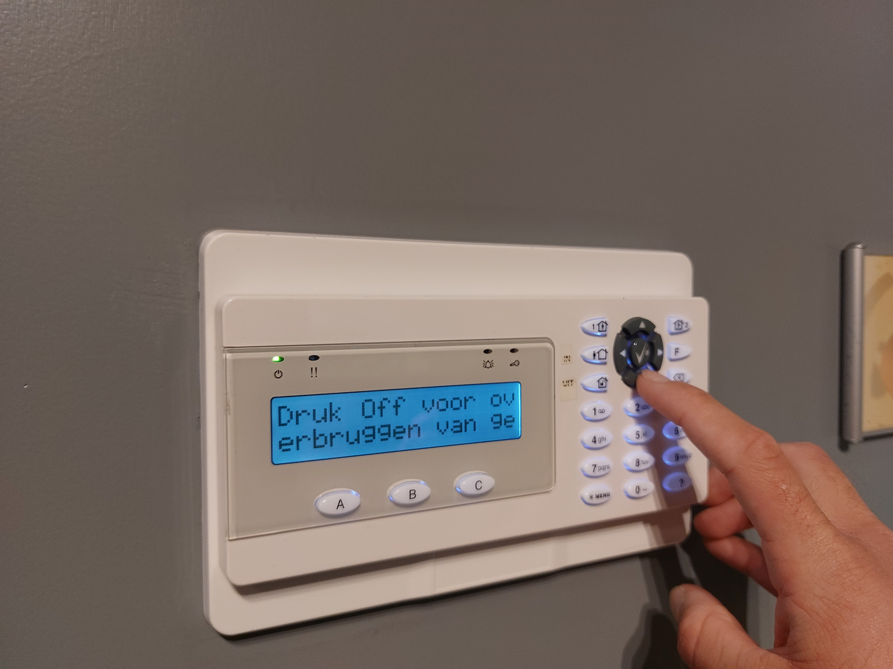
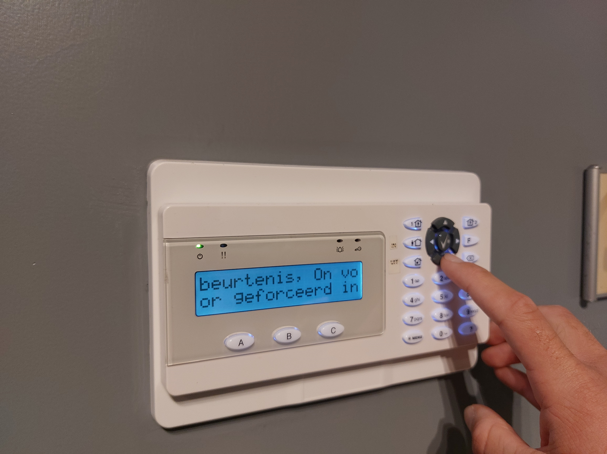
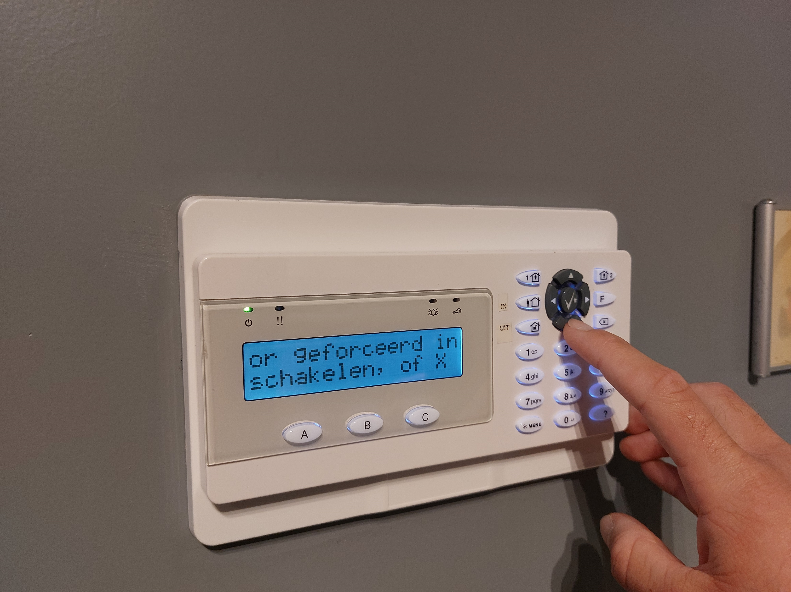
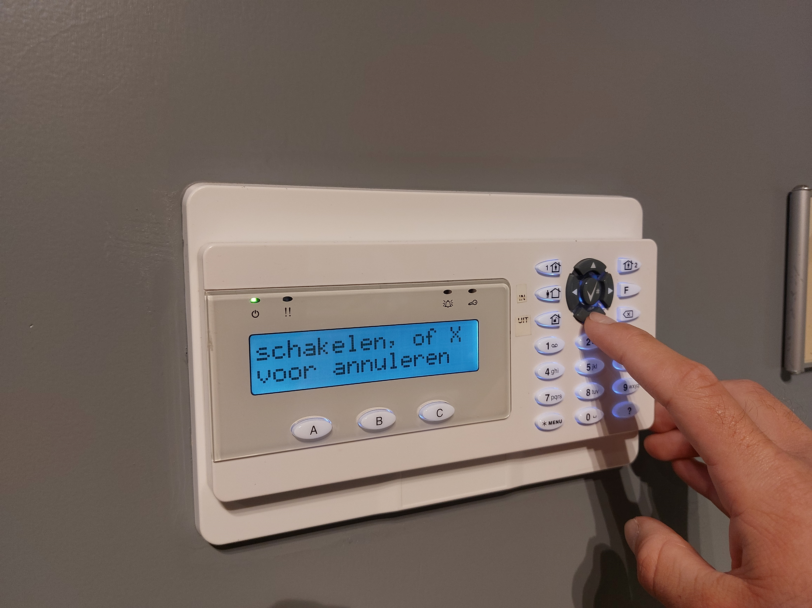
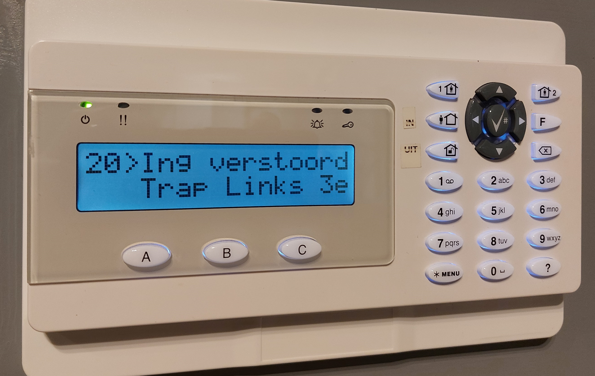
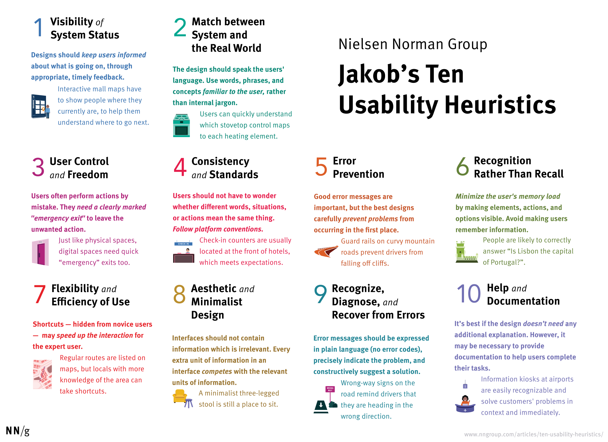
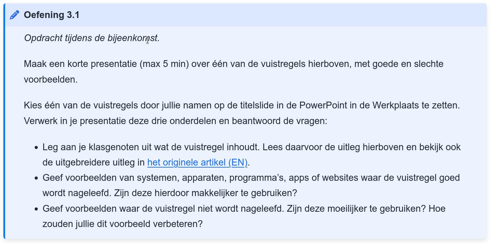

# De toepassingen <small>User stories en usability</small>

Q-highschool / Basis van Computer Science / Bijeenkomst 3

***

***

## User stories

Notes:
Heel simpel, in één zin: wie zijn de gebruikers, wat willen ze, waarom?

---

<!-- .slide: class="full-height" -->

**Als** zorgverlener,\
**wil ik** inzicht in de medicatiehistorie van de patiënt,\
**zodat** ik bij twijfel de nieuw voorgeschreven dosering gemakkelijk van verifiëren.

Bron: <https://agilescrumgroup.nl/wat-is-een-user-story/>

<!-- .element: style="font-size: 0.3em; position: absolute; left: 0; bottom: 0;" -->

---

**Als** informaticadocent\
**wil ik** in een Teamsmeeting mijn scherm delen,\
**zodat** ik een presentatie aan de leerlingen kan laten zien.

---

**Als** *gebruiker van het systeem*\
**wil ik** *iets doen met het systeem*,\
**zodat** *ik een bepaald doel bereik*.

***

## Wat is usability?

Zorgen dat je systeem bruikbaar is <!-- .element: class="fragment" -->

---

 

<!-- .element: class="r-stretch" -->

Notes:
Het werkt met een druppel. Waar moet je de druppel houden om het alarm te activeren?

---

 

<!-- .element: class="r-stretch" -->

 

<!-- .element: class="fragment r-stretch" -->

 

<!-- .element: class="fragment r-stretch" -->

 

<!-- .element: class="fragment r-stretch" -->

 

<!-- .element: class="fragment r-stretch" -->

---

 

<!-- .element: class="r-stretch" -->

Notes:
Waar zitten Off, On en X?

***

<!-- .element: class="r-stretch" -->

---

Zie [*De toepassingen* in de syllabus](../toepassingen.html#toepassingen-exercise-0)

Notes:
Werk in tweetallen. Verlaat deze meeting en bel elkaar in Teams om te overleggen. Ik ben hier, voor als je vragen hebt. Gebruik de PowerPoint in Werkplaats. Om 15:xx hier terug (schrijf op de slide) voor presentaties.

***

## Usability testing

Notes:
Vuistregels zijn handig, maar je weet pas echt of iets bruikbaar is, als je het getest hebt

---

<iframe width="960" height="540" src="https://www.youtube-nocookie.com/embed/_g4GGtJ8NCY?si=KxHEl6PqPFeZagiU&amp;start=48" title="YouTube video player" frameborder="0" allow="accelerometer; autoplay; clipboard-write; encrypted-media; gyroscope; picture-in-picture; web-share" allowfullscreen></iframe>

Notes:
Als je een nieuw systeem ontwerpt, dan wil je natuurlijk zo snel mogelijk testen zonder eerst het hele product te bouwen &rarr; papieren prototype

In de syllabus nog een voorbeeld

***

## Eindopdracht

Zorg dat je **voor volgende week** een samenwerking en een systeem hebt

Notes:
Nog geen keuze gemaakt? Dan kunnen we nu bespreken!

---

### Volgende week

Fysiek

Aan de slag met usability van jullie systeem

Indien mogelijk: neem je systeem mee!
