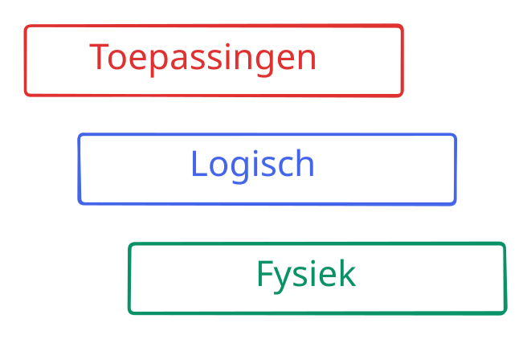
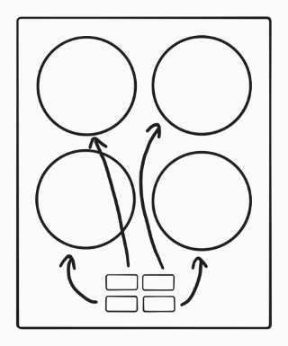
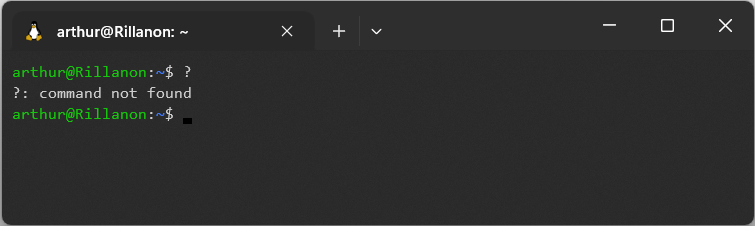

# De toepassingen <small>van jullie systeem</small>

Q-vak Informatica / Basis van Computer Science / Bijeenkomst 4

***

---

## Vandaag

- Opfrisquiz
- Usability testing: papieren prototype
- Aan de slag met de eindopdracht

***

## Opfrisquiz

---

Opwarmvraag: snap je hoe dit werkt?

- Ja
- Nee
- Ehm?
- Jazeker

<!-- .element: class="mc" -->

---

Wat is usability?

- Vuistregels volgen
- Testen hoe slim gebruikers zijn
- Zorgen dat je systeem bruikbaar is
- Zorgen dat iedereen alles kan gebruiken

<!-- .element: class="mc" -->

---

Wat zijn de onderdelen van een *user story*?

- Wie, wat, waar
- Als, wil ik, zodat
- Ik kan, omdat
- Met, ga ik, zodra

<!-- .element: class="mc" -->

---

Welke vuistregel gaat hier goed?

<!-- .element: class="r-stretch" -->

- Het lijkt op de echte wereld
- Consistentie en standaarden
- Herkennen is makkelijker dan herinneren
- Overzicht rust en ruimte

<!-- .element: class="mc" -->

---

Welke vuistregel gaat hier fout?

<!-- .element: class="r-stretch" -->

- Flexibiliteit en efficiëntie
- Help met het herkennen en oplossen van fouten
- Controle en vrijheid
- Herkennen is makkelijker dan herinneren

<!-- .element: class="mc" -->

***

## Usability testing

Notes:
Vuistregels zijn handig, maar je weet pas echt of iets bruikbaar is, als je het getest hebt

---

<iframe width="960" height="540" src="https://www.youtube-nocookie.com/embed/_g4GGtJ8NCY?si=KxHEl6PqPFeZagiU&amp;start=48" title="YouTube video player" frameborder="0" allow="accelerometer; autoplay; clipboard-write; encrypted-media; gyroscope; picture-in-picture; web-share" allowfullscreen></iframe>

Notes:
Als je een nieuw systeem ontwerpt, dan wil je natuurlijk zo snel mogelijk testen zonder eerst het hele product te bouwen &rarr; papieren prototype

---

<iframe width="960" height="540" src="https://www.youtube-nocookie.com/embed/yafaGNFu8Eg?si=LtmRI5d0PeplxPc6&amp;start=4" title="YouTube video player" frameborder="0" allow="accelerometer; autoplay; clipboard-write; encrypted-media; gyroscope; picture-in-picture; web-share" allowfullscreen></iframe>

Notes:
Alternatief voor papier: met PowerPoint en animaties kun je ook best iets maken. Professionele tools zijn Figma en Penpot, maar zou ik hiervoor niet aan beginnen als je daar niet mee bekend bent.

***

<!-- .slide: style="text-align: ;" -->

## Eindopdracht

1. Beschrijf de **user stories**
2. Kies een *user story* en
   ga na welke **vuistregels** beter toegepast kunnen worden
3. Maak een **papieren prototype** met deze verbeteringen

Zie [*Eindopdracht* in de syllabus](../eindopdracht.html#toepassingen)

***

## En verder

 

| Week  | Datum      | Hoe    | Tijd            | Onderwerp                                          |
| ----- | ---------- | ------ | --------------- | -------------------------------------------------- |
| 5     | 25-02-2026 | Online | 14.30-16.00     | Werken aan de eindopdracht: fysiek en toepassingen |
| 6     | 04-03-2026 | Fysiek | 14.30-16.00     | Logische laag: introductie en automaten            |
| 7     | 11-03-2026 | Online | 14.30-16.00     | Werken aan de eindopdracht: logisch                |

<!-- .element: style="font-size: .6em" -->

---

Fijne vakantie!