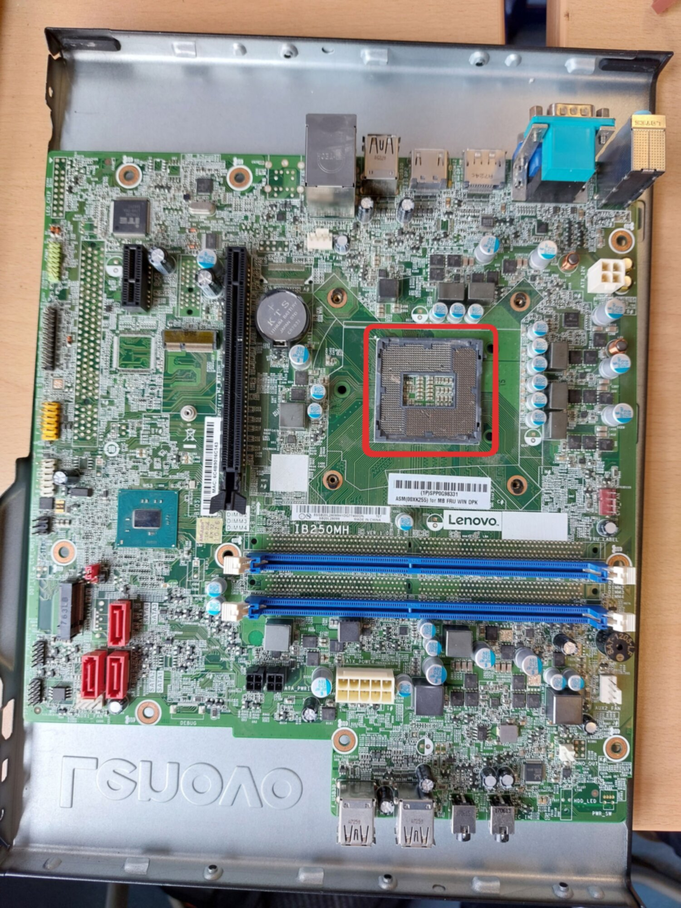
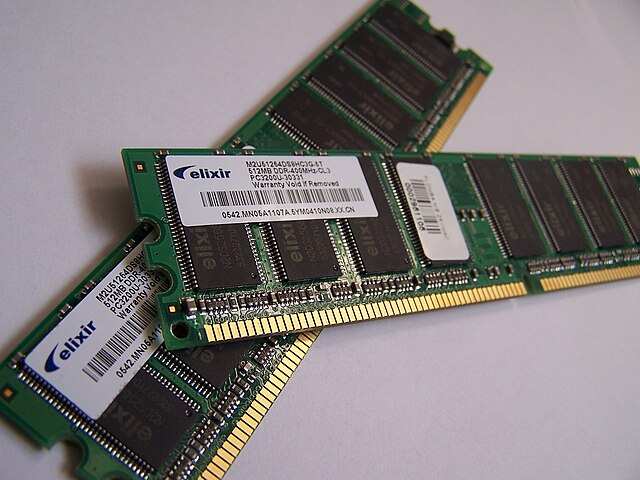
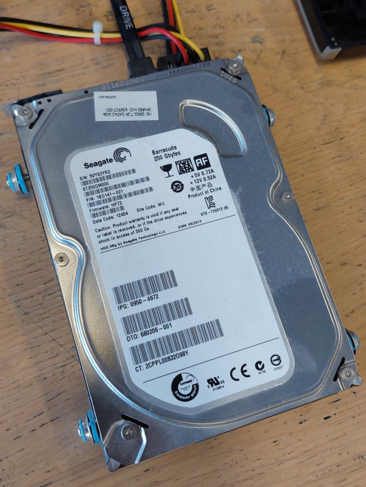
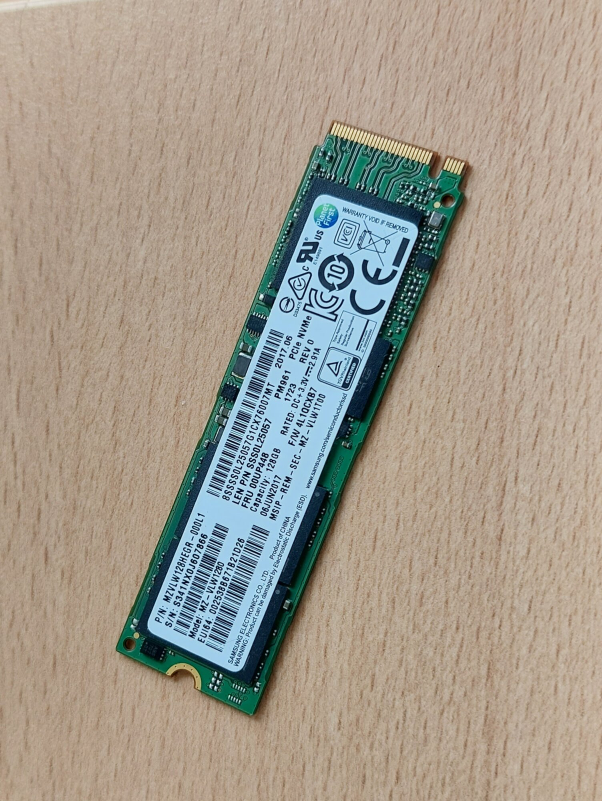

# Eindopdracht <small>Fysiek en toepassingen</small>

Q-highschool / Basis van Computer Science / Bijeenkomst 5

***

---

## Vandaag

- Opfrisquiz
- Aan de slag met de eindopdracht

***

## Opfrisquiz

---

Opwarmvraag: snap je hoe dit werkt?

- Ja
- Nee
- Ehm?
- Jazeker

<!-- .element: class="mc" -->

---

Wat zit hier op het moederbord?

- BIOS
- Werkgeheugen
- CPU
- CMOS

<!-- .element: class="mc" -->

Notes:
En wat doet de CPU?

---

Wat is dit?

- SSD
- Werkgeheugen
- Grafische kaart
- Processor

<!-- .element: class="mc" -->

---

Wat hebben een harde schijf en een SSD gemeen?

- Ronddraaiende onderdelen
- Vergelijkbare snelheid
- Slaan gegevens op
- Gebruiken magnetische schijven

<!-- .element: class="mc" -->

---

***

## Eindopdracht

1. Vul in de Werkplaats het onderwerp van je eindopdracht in (_Wie doet wat.xlsx_)
2. Plaats het werkdocument van je eindopdracht in de map _Eindopdracht_
   

---

### Eindopdracht: Fysiek

1. Welke onderdelen zitten in het systeem?
2. Waar zijn die onderdelen voor?
3. Hoe zijn die onderdelen met elkaar verbonden?

Zie [*Eindopdracht* in de syllabus](../eindopdracht.html#fysiek)

> **Tip: Als je je device niet uit elkaar mag halen, gebruik teardown images van sites als iFixit**

---

#### 3 soorten fysieke onderdelen

Sensoren

Actuatoren

Besturing

---

## Eindopdracht

Ga aan de slag met de eindopdracht.

**Tip: Maak eerst het onderdeel Fysiek af van je eindopdracht**

***

## En verder

 

| Week  | Datum      | Hoe    | Tijd            | Onderwerp                                          |
| ----- | ---------- | ------ | --------------- | -------------------------------------------------- |
| *5*     | *25-02-2026* | *Online* | *14.30-16.00*     | *Werken aan de eindopdracht: fysiek en toepassingen* |
| 6     | 04-03-2026 | Fysiek | 14.30-16.00     | Logische laag: introductie en automaten            |
| 7     | 11-03-2026 | Online | 14.30-16.00     | Werken aan de eindopdracht: logisch                |

<!-- .element: style="font-size: .6em" -->
