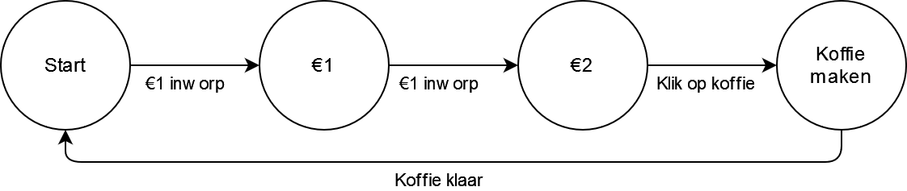
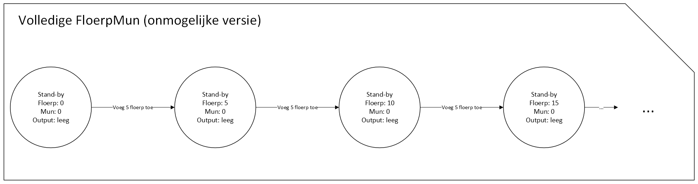
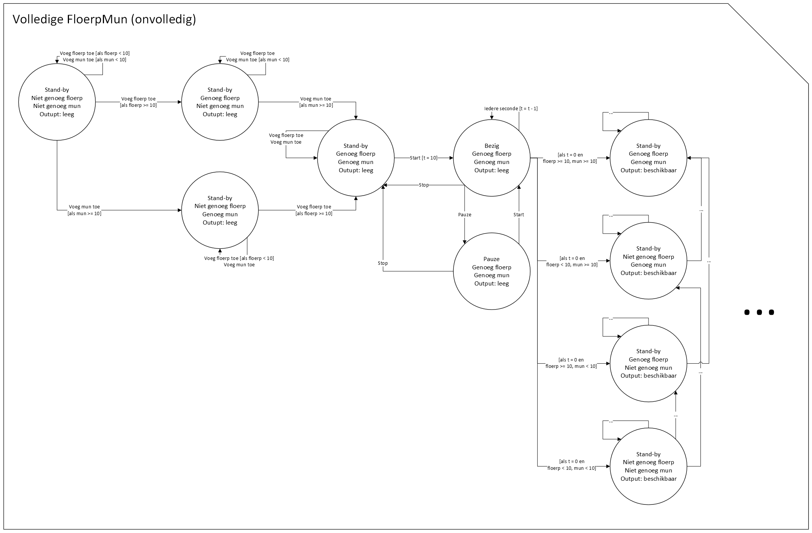

# De logische laag

Q-highschool / Basis van Computer Science / Bijeenkomst 5

***

## Opfrisquiz

---

Hoe noemen we de cirkels in deze automaat?

- Tekeningen
- Transities
- Toestanden
- Thema's

<!-- .element: class="mc" -->

---

Hoe noemen we de pijlen in deze automaat?

- Tekeningen
- Transities
- Toestanden
- Thema's

<!-- .element: class="mc" -->

---

Het apparaat is bezig en je wilt de deur openen. Wat doe je?

- Dat kan niet
- De deur openen
- Stoppen en dan de deur openen
- Wachten tot de deur open gaat

<!-- .element: class="mc grid" -->

---

Kun je dit apparaat starten met de deur open?

- Ja
- Nee

<!-- .element: class="mc grid" -->

***

## Het Floerp en Mun apparaat

<!-- .element: class="r-stretch" -->

---

<!-- .element: class="r-stretch" -->

---

<!-- .element: class="r-stretch" -->

---

<!-- .element: class="r-stretch" -->

***

## Eindopdracht

Zie syllabus.
