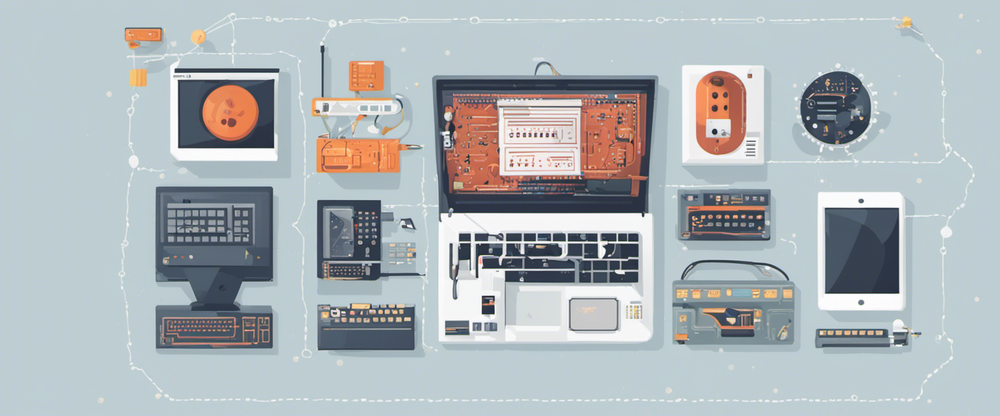

# Basis van Computer Science



Welkom bij de Basis van Computer Science! In deze module duiken we in de basisprincipes van de informatica: denk aan woorden als hardware, software, logica, abstractie, maar ook de toepassingen en de gebruikersinterface ontbreken natuurlijk niet. We gaan in vogelvlucht door de drie perspectieven van de informatica: de fysieke hardware, de logica en de toepassingen. Met die drie brillen op bekijken we computersystemen van alle kanten, om zo beter te begrijpen hoe ze werken.

Wat ga je leren? Aan het eind van deze module kun je ...

- de structuur en werking van een (computer)systeem uitleggen op drie niveaus van abstractie: fysiek, logisch en toepassingen.
- automaten gebruiken om de logische werking van een systeem weer te geven.
- de gebruikersinterface van een systeem evalueren aan de hand van vuistregels van goed ontwerp.

Zoals gebruikelijk bestaat de module uit een aantal fysieke lessen en een aantal lessen op afstand. In de fysieke lessen gaan we samen aan de slag met een bepaald perspectief op de computer: de fysieke hardware, de logische werking en de toepassingen en gebruikersinterface. In de lessen op afstand passen jullie die kennis toe op een systeem naar keuze. Het verslag dat je daarover schrijft, is ook meteen de {doc}`eindopdracht` die je inlevert in je portfolio aan het eind van de module.

Over inleveren gesproken, hier zijn enkele belangrijke data wat dat betreft:

- Deadline voor het inleveren van de eindopdracht: **{{ deadline }}**
- Deadline voor het aanvragen van uitstel: **{{ deadline_uitstel_aanvragen }}**
  - Uitgestelde deadline: **{{ deadline_uitstel }}**

Inhoudsopgave:

```{tableofcontents}
```
