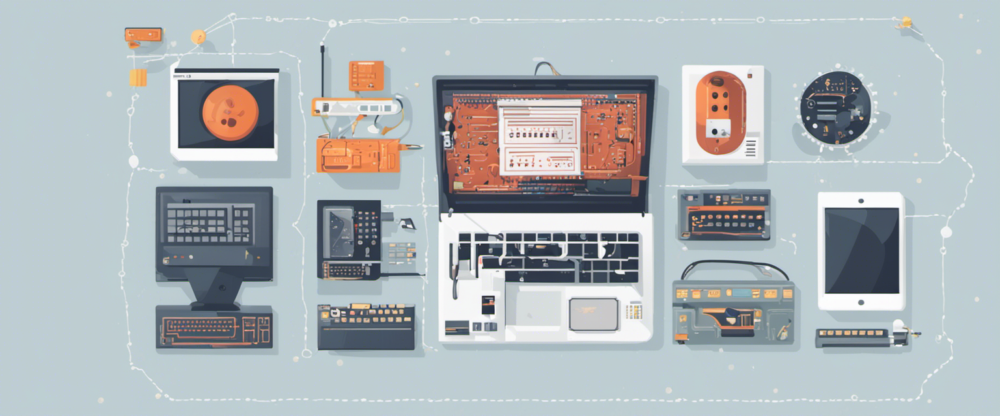

# {{ titel }}

<!-- Deze regel niet wijzigen! -->
*Versie {{ versie }}. Jouw docent: {{ docent }} ({{ docent_email }})*



Welkom bij de Basis van Computer Science! In deze module duiken we in de basisprincipes van de informatica: denk aan woorden als hardware, software, logica, abstractie, maar ook de toepassingen en de gebruikersinterface ontbreken natuurlijk niet. We gaan in vogelvlucht door de drie perspectieven van de informatica: de fysieke hardware, de logica en de toepassingen. Met die drie brillen op bekijken we computersystemen van alle kanten, om zo beter te begrijpen hoe ze werken.

Wat ga je leren? Aan het eind van deze module kun je ...

- de structuur en werking van een (computer)systeem uitleggen op drie niveaus van abstractie: fysiek, logisch en toepassingen.
- de gebruikersinterface van een systeem evalueren aan de hand van vuistregels van goed ontwerp.
- automaten gebruiken om de logische werking van een systeem weer te geven.

Zoals gebruikelijk bestaat de module uit een aantal fysieke bijeenkomsten en een aantal lessen op afstand. In de bijeenkomsten gaan we samen aan de slag met een bepaald perspectief op de computer: de fysieke hardware, de logische werking en de toepassingen en gebruikersinterface. Daarbij krijg je ook meteen de gelegenheid om die kennis toe te passen op een zelfgekozen systeem. Het verslag dat je daarover schrijft, is ook meteen de {doc}`eindopdracht` die je inlevert in je portfolio aan het eind van de module. In de {doc}`planning` kun je vinden wanneer ieder onderdeel aan bod komt.

Over inleveren en planning gesproken, hier zijn enkele belangrijke data wat dat betreft:

- Eerste inlevermoment voor de eindopdracht: **{{ eerste_inlevermoment }}**
- Tweede inlevermoment voor de eindopdracht: **{{ tweede_inlevermoment }}**
  - Meld je voor **{{ tweede_inlevermoment_melden }}** om het tweede inlevermoment te gebruiken

:::{seealso}

Vond je de design-kant van deze module leuk en wil je meer leren over usability en het ontwerpen van gebruikersinterfaces? Bij de volgende modules komt dat ook aan bod:

- [*Webdesign*](https://informatica.q-vakken.nl/webdesign): in deze module leer je hoe je zelf een website bouwt, hoe een goede website eruit ziet en hoe je dat goed test met je gebruikers. Hier krijg je dus de kans om een usability test uit te voeren met je eigen ontwerp, in plaats van een systeem dat al bestaat.
- *Gamedesign*: wil je alles weten over hoe je een goede game ontwikkelt, die mensen kunnen én willen spelen? Dan is deze dagmodule iets voor jou!
- *Domotica*: uitgekeken op de standaard gebruikersinterfaces van computers? Bij Domotica ga je aan de slag met slimme apparaten in huis, die reageren op jouw gedrag, ook zonder dat je knoppen op een scherm hoeft te gebruiken.

Wil je graag verder met hardware en fysieke onderdelen?

- *Programmeren met Arduino*: bouw je eigen systeem! De Arduino is een microcontroller met alle onderdelen van een computer, waar je zelf knoppen, schermpjes, lampjes, motoren en allerlei sensoren op aan kunt sluiten. Die kun je vervolgens programmeren om precies te doen wat jij wilt!

Heb je zin om dieper te duiken in de logische werking van computers?

- [*Computer Architectuur*](https://informatica.q-vakken.nl/computer_arch): we hebben alle onderdelen van de computer gezien, maar hoe werkt die CPU nou echt? In deze module leer je hoe de computer programma's uitvoert en wat binaire getallen daar mee te maken hebben.

:::


Inhoudsopgave:

```{tableofcontents}
```
