# De logische laag

We hebben gezien hoe computers en andere systemen fysiek in elkaar steken, maar computers zijn natuurlijk niet alleen maar ene bouwpakket om in en uit elkaar te schroeven. We willen ook weten wat je ermee kan! Dat is de logische laag: hoe processen werken. We gaan beschrijven hoe systemen en processen werken aan de hand van *automaten*.

## Software

Computers zijn universele machines: de hardware kan alles berekenen wat berekenbaar is en als je je computer voor iets anders wilt gebruiken, hoef je de hardware niet aan te passen. Dat is niet vanzelfsprekend: de eerste computers werden geprogrammeerd door draadjes te verbinden en schakelaars om te zetten. Zo werd de hardware aangepast aan het probleem dat opgelost moest worden.

Tegenwoordig gebruiken we *soft*ware om te beschrijven hoe een computer werkt. Het is *soft* omdat het makkelijker te veranderen is dan *hard*ware. In deze module gaan we zelf geen software programmeren (dat leer je bij de Basis van Programmeren met Python), maar we gaan wel beschrijven hoe een programma of een systeem werkt.

## Automaten

Dit is een automaat:

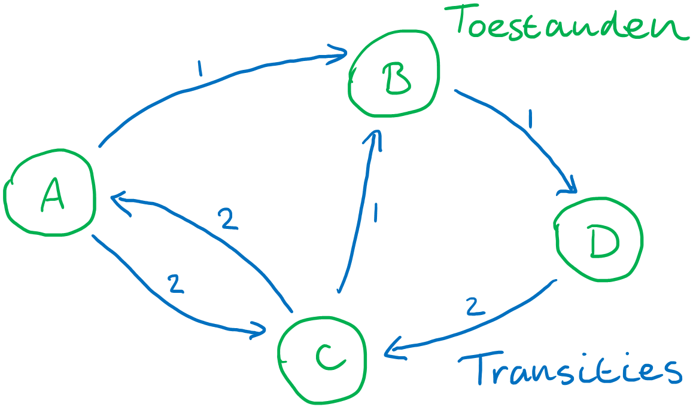

Een automaat heeft twee onderdelen: *toestanden* en *transities*. Met de toestand bedoelen we de huidige staat van een systeem of programma en transities zijn acties waarmee je naar een andere toestand gaat. Een koelkast met de deur dicht en het lampje uit is bijvoorbeeld een toestand en met de deur open en het lampje aan is een andere. De transitie van de eerste naar de tweede is het openen van de deur. Transities kunnen plaatsvinden doordat een gebruiker een actie onderneemt, of doordat het systeem zelf iets doet.

Zie bijvoorbeeld de automaat van deze (simpele) koffiemachine. Bij deze automaat kun je voor €2 koffie halen, maar je kunt alleen betalen met munten van €1.


In de "Start" toestand is er maar één actie mogelijk: een €1 munt inwerpen. Als een gebruiker dat doet, komt de automaat in een nieuwe toestand waarin er €1 in de machine zit. De gebruiker kan nogmaals €1 inwerpen en dan komt de machine in een toestand waar het mogelijk is om koffie te krijgen. Als de gebruiker dan op "koffie" klikt, gaat de machine koffie maken. Als die koffie klaar is, gaat het vanzelf terug naar de "Start" toestand.

:::{exercise} Tikkertje
:label: tikkertje

Vier personen spelen tikkertje. Teken een automaat die weergeeft hoe het spel kan verlopen.
:::

:::{solution} tikkertje
Er zien vier toestanden: persoon A is de tikker, persoon B is de tikker, persoon C is de tikker of persoon D is de tikker. Als persoon A de tikker is, kan die B, C of D tikken, dus zijn er die transities van persoon A naar B, C en D. Dat geldt natuurlijk ook voor alle andere spelers.

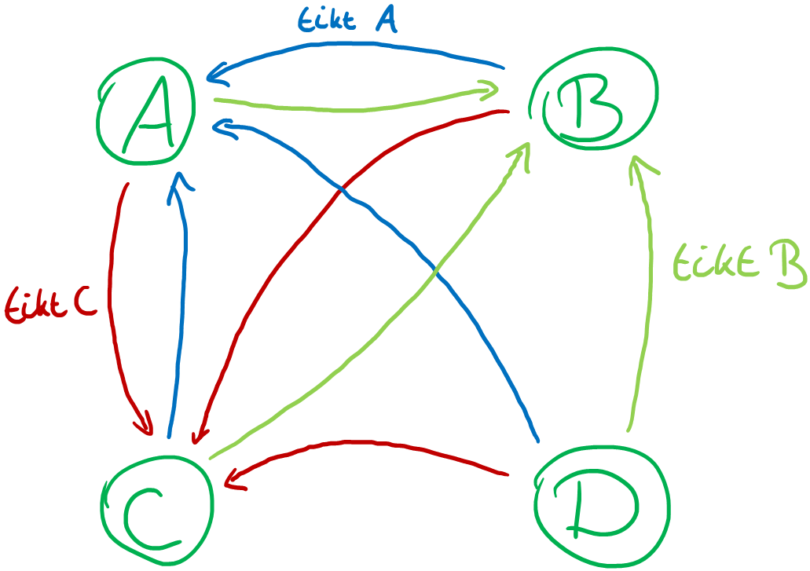
:::

:::{exercise} Schateiland
Deze opdracht doen we tijdens de les.

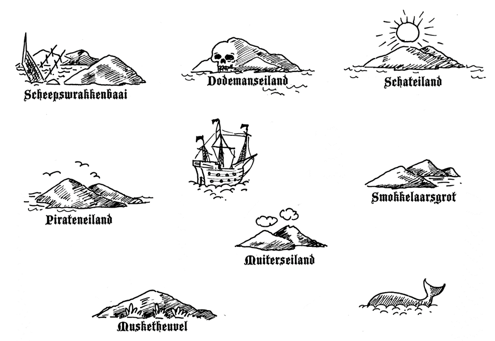

Je krijgt een kaart zoals hierboven met de 7 pirateneilanden. Het is jouw taak om een route te vinden van het Pirateneiland naar Schateiland (waar natuurlijk een schat begraven ligt, daarom heet het zo). Tussen de eilanden varen twee boten, boot A en boot B, waarop je mee kunt varen om je tussen de eilanden te verplaatsen. (Op elk eiland kun je uiteraard overstappen.) Zeven klasgenoten hebben een kaartje gekregen met informatie over de boten die vanaf hun eiland vertrekken en waar die boten heen gaan. Vraag je klasgenoten om die informatie en maak zo de kaart compleet met alle routes die de boten varen.

Wat is de kortste route (minste boottochten) om op schateiland te komen? Is er een route waarbij je elke keer moet overstappen? Kun je alle eilanden bij langs gaan op je route? Bestaat er ook een langste route?

*Bron: [CS Unplugged](http://www.csunplugged.nl/11-eindige-automaat/)*
:::

Zoals je bij het schateiland uitzoekt welke transities je kunt nemen vanaf elk eiland, kun je bij elk systeem uitzoeken wat de mogelijke transities zijn en in welke toestanden je dan terecht komt. Zo kun je alle mogelijkheden van een systeem beschrijven en schematisch weergeven hoe een systeem logisch werkt.

:::{exercise} De mysterieuze munt
Vrienden hebben op het internet een spelletje gevonden waar een robot een munt opgooit en de speler moet proberen te raden of het kop of munt gaat worden. In eerste instantie leek het heel eenvoudig, de kans om te winnen was 50/50 — althans dat dachten ze. Na een tijdje begonnen ze argwanend te worden. Er leek wel een patroon te zitten in de worpen van de munt.

Was het spel eerlijk? Helemaal niet! Ze besloten het te onderzoeken. Marie hield vanaf nu de resultaten bij en dit is wat ze vond: (k = kop, m = munt)

```
k k m k k m k k k m m k k k k m m k m m m k k k
k k m k k k m m m k k k m m m k k k k k k m m k
m m m m m k m m k m m m k k k m m k k k m k k k
k k k k k k m m k k k m m m m k k k k k m m m m
m m m
```

Kun jij een voorspelbaar patroon vinden dat je gemiddeld meer dan 50% kans geeft om goed te raden?

Er is een eenvoudige automaat die de uitkomsten van de opeenvolgende worpen beschrijft. Kun je die vinden? (Hint: er zijn maar 4 toestanden!)

<details>
<summary>Klik voor meer hints.</summary>
De toestanden hebben hier geen betekenis, of er kop of munt wordt gegooid wordt bepaald door de transities die je neemt. Net als dat BABA een route tussen de pirateneilanden was, is kkm hier een route tussen de vier eilanden.

Je begint in een starttoestand. De eerste worp eindigt in kop, dus er moet vanuit deze toestand een "kop-boot" vertrekken naar een nieuwe toestand. Je hebt nu de eerste transitie. De volgende worp is weer kop, dus vanuit deze toestand vertrekt weer een "kop-boot", naar een nieuwe toestand of terug naar de start-toestand. Vanuit daar moet een "munt-boot" vertrekken, want dat is de volgende worp, etc. Er is één manier waarop je de transities kunt verdelen dat de resultaten van Marie een valide route vormen.
</details>

*Bron: [CS Unplugged](http://www.csunplugged.nl/11-eindige-automaat/)*
:::

## Bonus: Turing machines en wat computers niet kunnen

We hebben eerder al gezien dat computers universele machines zijn: ze kunnen alles berekenen wat berekenbaar is. Alan Turing ontwikkelde een model (abstractie!) van de computer: de Turing machine. Een Turing machine kan alles wat een computer kan, welke computer je ook bekijkt. Omgekeerd: elke machine die een Turing machine kan simuleren, noemen we *Turing complete*. Dat betekent dat die machine alles kan berekenen wat een computer ook kan. Soms wat langzamer, maar in theorie kun je elk programma op elke computer uitvoeren.

De meest gekke dingen zijn Turing complete: het animatiesysteem in [PowerPoint is Turing complete](https://www.youtube.com/watch?v=uNjxe8ShM-8) net als Minecraft. Je kunt dus in PowerPoint of Minecraft een computer bouwen die alles kan wat de computer waarop je PowerPoint of Minecraft uitvoert ook kan. In theorie kun je dus in Minecraft een computer bouwen en daarop Minecraft spelen (al gaat dat waarschijnlijk wel heel langzaam).

Een Turing machine heeft twee onderdelen: een automaat, die beschrijft hoe de computer werkt, en een tape die als geheugen functioneert. De tape is opgedeeld in vakjes en ik elk vakje staat een 1 of een 0. Daarnaast is er een pointer die aangeeft naar welke plek in de tape we nu kijken.

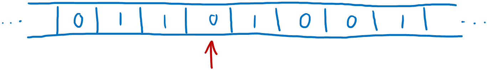

De transities in de automaat van de Turing machine hebben drie labels: wat er nu in het geheugen moet staan om die transitie te kunnen maken, wat er op de huidige plek in het geheugen wordt geschreven als deze transitie gevolgd wordt en welke kant de pointer op de tape verschoven wordt (links, rechts, of blijft op dezelfde plek).

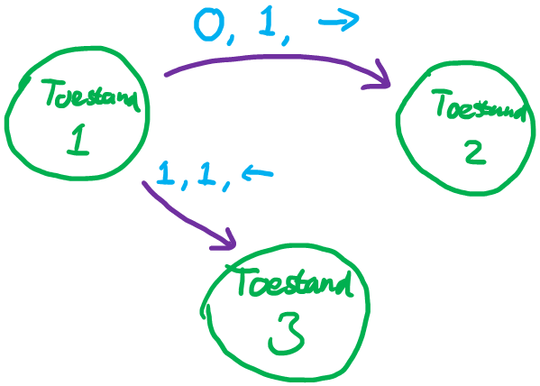

Met een Turing machine kan elk programma dat je op een computer uitvoert beschreven worden. Dat is de kracht van automaten!

### Stoppen of wachten?

Als je Windows gebruikt, heb je waarschijnlijk wel eens een melding zoals deze gezien:

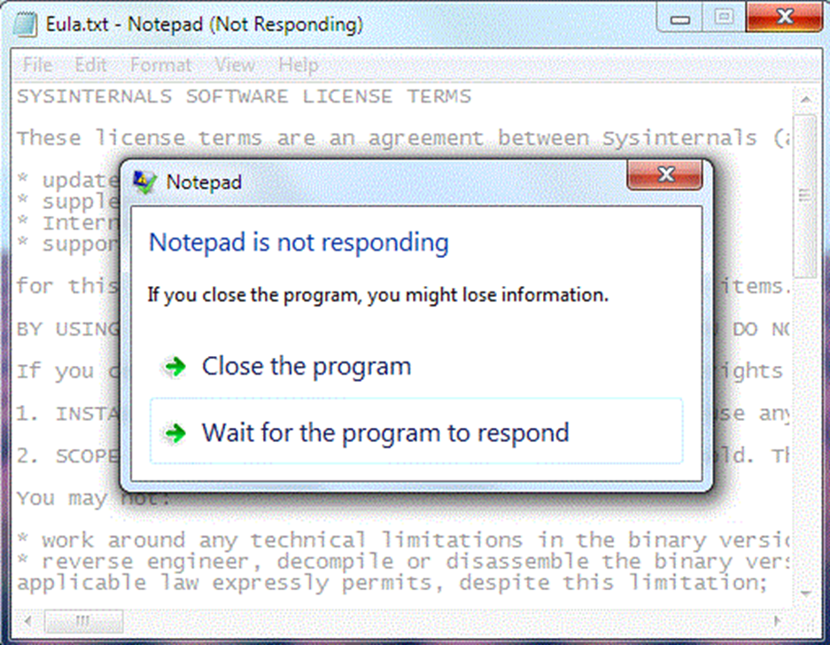

*Bron: [Microsoft Learn](https://learn.microsoft.com/en-us/windows/win32/win7appqual/preventing-hangs-in-windows-applications)*

Dat gebeurt als Windows detecteert dat een programma niet meer reageert op jouw acties en dus moet jij nu kiezen of je wilt wachten tot het programma (misschien) weer gaat reageren of dat je het programma wilt sluiten. Het is voor een computer namelijk niet mogelijk om te zien of een programma is vastgelopen en in een oneindige lus is beland, of dat het programma gewoon traag is en nog met dingen bezig is. Met Turing machines kunnen we dat bewijzen! 

>  Bekijk ook [deze video](https://www.youtube.com/watch?v=VyHbd6sx5Po) voor een vergelijkbaar (maar subtiel anders) bewijs.

We maken een Turing machine van het programma dat we willen analyseren en die machine noemen we *M*. Deze machine loopt dus over een tape met data en in de machine zit een automaat die bepaald hoe het programma werkt. Een Turing machine kan elke computer simuleren, dus ook al weten we niet precies hoe *M* werkt, we weten wel dat we *M* kunnen maken en dat is genoeg!

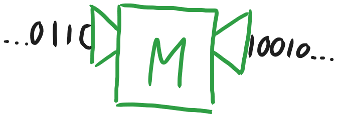

Omdat een Turing machine gewoon een automaat is, kunnen we die opschrijven als data op een tape en een Turing machine uitvoeren op haar eigen "code". Net zoals dat je de code van Kladblok met Kladblok zou kunnen bewerken! Dat klinkt misschien een beetje vreemd, maar later in dit bewijs is het handig. Als we de beschrijving *M* als input aan de machine *M* geven, tekenen we dat zo:

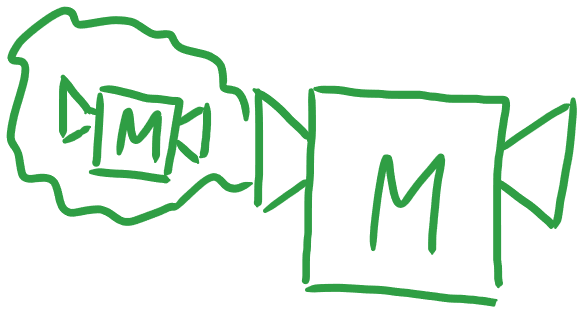

We willen dus weten of *M* ooit klaar is en stopt, of dat die machine voor eeuwig in een loop blijft draaien. Stel nu dat we een Turing machine hebben die dat kan bepalen en we noemen die machine *H*. *H* leest op de tape een beschrijving van de machine *M*. *H* voert deze machine *M* uit op de beschrijving, de "code", van *M* zelf, net als op de afbeelding hierboven. Als *M* dan in een oneindige loop draait, dan stopt de machine *H*. Als *M* echter stopt, dan gaat *H* in een oneindige loop. Dit kan omdat we stellen dat *H* kan bepalen of *M* in een oneindige loop zit en dan zelf kan kiezen om te stoppen of naar een oneindige loop te gaan.

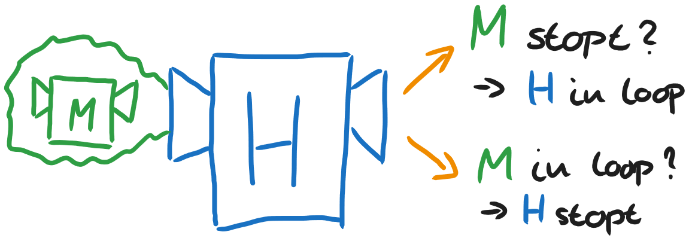

Tot zover gaat alles goed. Wat nu als we aan *H* vragen of *H* ooit stopt (als je *H* de beschrijving van *H* als input geeft)?

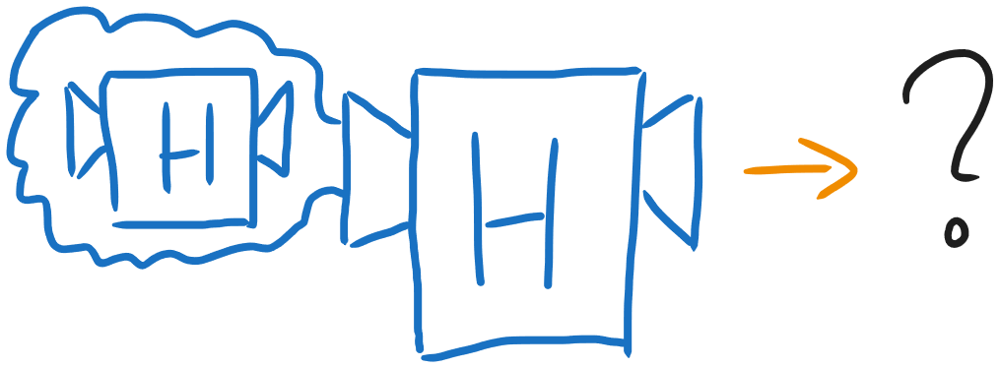

Dit is dus dezelfde vraag die *H* intern stelt: *H* voert machines uit op hun eigen beschrijving, dus hier voert het *H* uit op de beschrijving van *H*, net als wij nu doen. Als onze machine dan detecteert dat *H* stopt, dan gaat *H* dus in een oneindige loop. Maar als *H* in een oneindige loop gaat, dan stopt *H*...

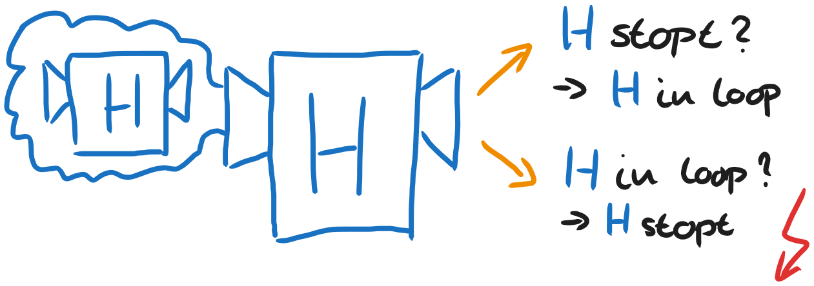

Daar gaat iets fout! Deze situatie spreekt zichzelf tegen. Gelukkig hebben we aan het begin een aanname gedaan en nu blijkt dat dat lijdt tot een paradox. We moeten dus concluderen dat deze machine *H* niet kan bestaan! Computers kunnen dus niet bepalen of een programma in een oneindige loop zit, of dat het programma toch nog uit zichzelf zal stoppen.

## Eindopdracht

Teken een automaat die beschrijft hoe jullie systeem werkt. In welke toestanden kan het systeem zijn? Welke acties kunnen gebruikers nemen? Welke acties gebeuren automatisch, bijvoorbeeld met een timer? In welke staten zijn die acties geldig? En naar welke staat ga je als zo'n actie is uitgevoerd?

Probeer het systeem zo precies mogelijk te beschrijven. Dat is belangrijker dan dat je het hele systeem volledig uitwerkt: beperk je eerst tot de basislaag (bijvoorbeeld de verschillende menu's en functies van je rekenmachine of combimagnetron). Zorg ervoor dat er in jullie automaat geen acties mogelijk zijn die eigenlijk niet kunnen. Als de koffieautomaat alleen voor €2 koffie geeft, maak dan niet een automaat waar je je eigen prijs kunt bepalen.


Als je de basis hebt staan, kun je die verder uitbreiden door meer onderdelen van het systeem in detail te beschrijven. Als het systeem te groot is, kun je de automaat opdelen in verschillende stukken die verschillende processen of ingewikkelde stappen in een proces beschrijven. In elk onderdeel overlapt dan een begintoestand met een toestand uit een ander deel.

Maak gebruik van [draw.io](https://app.diagrams.net) om een leesbare tekening van de automaat te maken. Als je het bestand opslaat in Google Drive, is het via de knop *Delen* rechtsbovenin ook mogelijk om samen aan dit bestand te werken.

Naast een duidelijke tekening van de automaat geef je ook een tekstuele beschrijving die de lezer door de verschillende delen van de automaat loodst en de processen beschrijft. Leg uit welke keuzes je hebt gemaakt bij het maken van de automaat, welke aspecten je hebt versimpeld en welke delen je hebt weggelaten.

Zie [de rubric bij de eindopdracht](eindopdracht.md#logisch) om te zien hoe dit onderdeel beoordeeld wordt.
