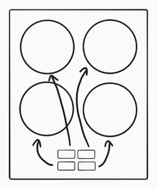
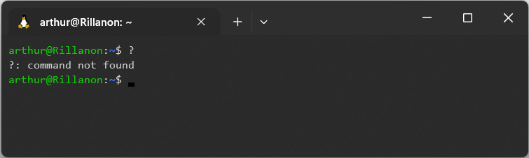

# De toepassingen

We hebben gezien hoe computers en andere systemen zijn opgebouwd uit onderdelen, hoe die onderdelen samenwerken om het systeem bepaalde functionaliteit te geven (en hoe je dat met een automaat kunt beschrijven). Dat is allemaal leuk en aardig, maar uiteindelijk gaat het natuurlijk om de toepassing: het systeem is ergens voor, het heeft een doel. Het is dus belangrijk dat een systeem in staat is om te doen waar het voor bedoeld is, maar dat is niet het enige: een koffiezetapparaat dat goede koffie kan zetten, maar waarvan niemand weet hoe het werkt, is ook niet heel nuttig. Dat is de kern van *usability*: een systeem moet bruikbaar zijn om nuttig te zijn.

## Tien vuistregels van goed design

Er zijn een heleboel factoren waardoor systemen makkelijk of juist moeilijk te gebruiken zijn, en de enige manier waarop je echt weet of een systeem te gebruiken is, is door het te testen met echte gebruikers. Er zijn echter wel een aantal vuistregels die in veel gevallen van toepassing zijn en die je dus kunt inzetten om je ontwerp gebruiksvriendelijk te maken voordat je de eerste tests uitvoert. Jakob Nielsen maakte in 1994 een lijst van 10 vuistregels die nog altijd goed toepasbaar zijn.

De tien vuistregels hieronder zijn gebaseerd op de [10 Usability Heuristics for User Interface Design door Jakob Nielsen](https://www.nngroup.com/articles/ten-usability-heuristics/). Het zijn uitdrukkelijk richtlijnen en geen regels, want niet alle richtlijnen zijn altijd van toepassingen. Bijna altijd moet je een afweging maken tussen de verschillende richtlijnen, en kun je ze dus niet allemaal vasthouden.

### #1: De toestand is duidelijk

*Originele titel: Visibility of system status*

Het systeem moet duidelijk aangeven in welke toestand het zich bevindt, zodat gebruikers weten waar ze aan toe zijn. Indicatielampjes, laadbalken, statuscodes etc. zijn allemaal manieren om de huidige toestand aan te duiden. Op kaarten die je in grote gebouwen of in de stad tegenkomt, staat vaak met een grote rode stip aangegeven waar je op dat moment bent: dat geeft jouw huidige toestand aan en zorgt ervoor dat je meteen weet welke straten je in kan lopen en waar je terecht komt.

### #2: Het lijkt op de echte wereld

*Originele titel: Match between system and the real world*

Een ontwerp moet gebruikers aanspreken "in hun eigen taal", dus niet met het jargon van de onderdelen, maar met termen uit de echte wereld en de toepassingen van het systeem. Als er een relatie is tussen fysieke elementen en de besturing, is het logisch om dezelfde structuur te gebruiken: op een kookplaat is het handig als de knoppen dezelfde layout hebben als de kookpitten of verwarmingszones.

### #3: Controle en vrijheid

*Originele titel: User control and freedom*

Gebruikers moeten de volledige controle hebben over het systeem. Als ze iets per ongeluk doen, moet er een makkelijke manier zijn om dat ongedaan te maken. De meeste programma's op je computer hebben hiervoor een *undo* functie (Ctrl+Z).

### #4: Consistentie en standaarden

*Originele titel: Consistency and standards*

Gebruikers hebben bepaalde verwachtingen en als je aan die verwachtingen voldoet, is het voor iedereen duidelijker. Probeer niet het wiel opnieuw uit te vinden als er een standaard oplossing is, want de kans is groot dat het resultaat een vrij matig wiel is en niemand snapt hoe het werkt. Iedere auto heeft de pedalen in dezelfde volgorde (de rem links van het gas, en links daarvan de koppeling), zodat je nooit hoeft na te denken waar welk pedaal zit.

### #5: Fouten voorkomen

*Originele titel: Error prevention*

Het is altijd goed als het systeem duidelijk aangeeft als er iets fout is (#1), maar het is nog beter om dat te voorkomen. Denk aan de vangrails langs een weg naast het kanaal: als de gebruiker alles goed doet, is die niet nodig, maar het voorkomt een nog veel groter probleem als er toch iets niet goed gaat.

### #6: Herkennen is makkelijker dan herinneren

*Originele titel: Recognition rather than recall*

Waarom zijn multiple choice vragen makkelijker dan open vragen?

A. Omdat je alleen het juiste antwoord hoeft te herkennen en het niet zelf hoeft te bedenken.

Dit is ook waarom een grafische gebruikersinterface (GUI) voor de meeste mensen makkelijker te gebruiken is dan een ouderwetse console of terminal: voor die laatste moet je de juiste commando's onthouden, terwijl je in een GUI alle knoppen kunt zien.

### #7: Flexibiliteit en efficiëntie

*Originele titel: Flexibility and efficiency of use*

Een systeem moet natuurlijk makkelijk te begrijpen zijn voor nieuwe gebruikers, maar voor de experts is het handig om ook snellere manieren te hebben. Shortcuts (zoals de eerder genoemde Ctrl+Z) zijn hier een goed voorbeeld van, maar het is ook een reden dat sommigen wel graag een terminal gebruiken: als je de commando's goed weet, kun je die soms sneller intypen dan dat je de juiste knop in het menu vindt.

### #8: Overzicht, rust en ruimte

*Originele titel: Aesthetic and minimalist design*

Een gebruikersinterface moet geen overbodige informatie bevatten, want alle extra informatie zorgt ervoor dat het geheel minder overzichtelijk is. Het betekent niet dat elke pagina eruit moet zien als de homepagina van Google, maar voor de homepagina van een zoekmachine heb je ook niet meer nodig dan een zoekveld.

### #9: Help met het herkennen en oplossen van fouten

*Originele titel: Help users recognize, diagnose, and recover from errors*

Als er iets fout gaat in je systeem, zorg dan dat de gebruiker weet wat dat is en hoe die het op kan lossen. Een foutcode is niet ideaal, want die moet je eerst opzoeken (als dat überhaupt te vinden is). Als gebruikers een fout maken, wil je ze daar zo snel mogelijk op wijzen. Als ze een ongeldige postcode intypen in een adresformulier, kun je dat beter laten weten als ze net het postcodeveld verlaten dan wanneer ze aan het eind het formulier versturen.

### #10: Hulp en handleidingen

*Originele titel: Help and documentation*

Het is natuurlijk het beste als je systeem geen uitleg nodig heeft, maar toch is het altijd goed om een duidelijke handleiding of andere bron van hulp te hebben. In veel traditionele computerprogramma's kun je op F1 drukken om het hulpvenster te openen. Vooral in ingewikkelde applicaties als Photoshop kan dat heel handig zijn. Bij modernere applicaties en webapps ontbreekt die functionaliteit vaak, maar kun je soms wel via een chat om hulp vragen.

:::{exercise}
*Opdracht tijdens de les.*

Maak een korte presentatie (max 5 min) over één van de vuistregels hierboven, met goede en slechte voorbeelden.

Je krijgt van je docent één van de vuistregels toegewezen. Verwerk in je presentatie deze drie onderdelen en beantwoord de vragen:

- Leg uit aan je klasgenoten uit wat de vuistregel inhoudt. Lees daarvoor de uitleg hierboven en bekijk ook de uitgebreidere uitleg in [het originele artikel (EN)](https://www.nngroup.com/articles/ten-usability-heuristics/).
- Voorbeelden van systemen, apparaten, programma's, apps of websites waar de vuistregel goed wordt nageleefd. Zijn deze hierdoor makkelijker te gebruiken?
- Voorbeelden waar de vuistregel niet wordt nageleefd. Zijn deze moeilijker te gebruiken? Hoe zouden jullie dit voorbeeld verbeteren?
:::

## Eindopdracht

Evalueer de usability van jullie systeem aan de hand van de 10 vuistregels voor goed design. Hoe zouden jullie het systeem verbeteren? Test eventueel jullie verbetering met een testgebruiker.
